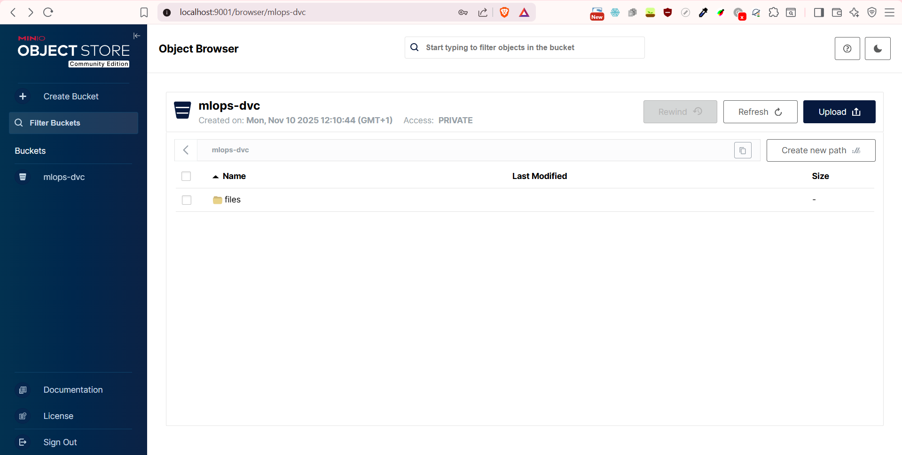
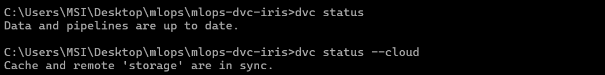
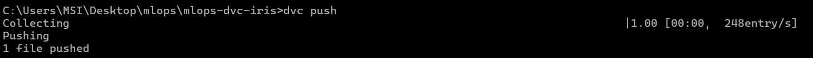

# TP Data Versioning avec DVC 🚀

## 📋 Description du Projet

Ce projet est un dépôt pédagogique pour le **TP MLOps** consacré au **versioning de données** avec **DVC (Data Version Control)**. Il utilise **MinIO** comme stockage distant S3 local pour démontrer la gestion et le versioning des données dans un workflow MLOps.

Le dataset utilisé est le célèbre **jeu de données Iris** (`iris.csv`), qui permet d'illustrer :

- Le suivi des données avec DVC (pointeurs dans Git, blobs dans le remote)
- La **reproductibilité** des artefacts de données
- La synchronisation entre le cache local et le stockage distant

## 🎯 Objectifs du TP

1. ✅ Configurer un stockage distant S3 avec MinIO
2. ✅ Initialiser DVC dans un projet
3. ✅ Tracker des données avec DVC
4. ✅ Pousser les données vers le remote storage
5. ✅ Vérifier la synchronisation des données

## 🛠️ Prérequis

- **Git** installé
- **DVC** installé (`pip install dvc[s3]`)
- **Docker** et **Docker Compose** installés
- **Python 3.x**

## 📦 Installation et Configuration

### 1. Cloner le dépôt

```bash
git clone <url-du-repo>
cd mlops-dvc-iris
```

### 2. Démarrer MinIO avec Docker Compose

Le fichier `docker-compose.yml` est déjà configuré pour lancer MinIO :

```bash
docker-compose up -d
```

**Accès à l'interface MinIO :**

- URL Console : http://localhost:9001
- **Username** : `minio`
- **Password** : `minio12345`
- Port API S3 : `9000`

### 3. Configuration DVC

Le remote storage DVC est déjà configuré dans `.dvc/config` :

```ini
[core]
    remote = storage
['remote "storage"']
    url = s3://mlops-dvc
    endpointurl = http://localhost:9000
```

**Variables d'environnement nécessaires :**

```bash
export AWS_ACCESS_KEY_ID=minio
export AWS_SECRET_ACCESS_KEY=minio12345
```

Ou sous Windows PowerShell :

```powershell
$env:AWS_ACCESS_KEY_ID="minio"
$env:AWS_SECRET_ACCESS_KEY="minio12345"
```

## 📊 Structure du Projet

```
mlops-dvc-iris/
├── data/
│   └── raw/
│       ├── iris.csv          # Dataset Iris
│       └── iris.csv.dvc      # Fichier de tracking DVC
├── img/                      # Captures d'écran du TP
├── _minio/                   # Volume de données MinIO
├── .dvc/                     # Configuration DVC
├── .git/                     # Dépôt Git
├── docker-compose.yml        # Configuration MinIO
└── README.md                 # Ce fichier
```

## 🚀 Workflow DVC

### Vérifier le statut DVC

```bash
dvc status
```

**Résultat attendu :**

```
Data and pipelines are up to date.
```

### Vérifier la synchronisation avec le remote

```bash
dvc status --cloud
```

**Résultat attendu :**

```
Cache and remote 'storage' are in sync.
```

### Pousser les données vers MinIO

```bash
dvc push
```

**Résultat attendu :**

```
Collecting
Pushing
1 file pushed
```

### Récupérer les données depuis MinIO

```bash
dvc pull
```

## 📸 Captures d'écran

### 1. Interface MinIO - Bucket `mlops-dvc`



L'interface MinIO montre le bucket `mlops-dvc` créé automatiquement par DVC, contenant le dossier `files/` avec les données versionnées.

### 2. Statut DVC



Vérification que les données et pipelines sont à jour localement.

### 3. Push DVC vers MinIO



Upload réussi des données vers le stockage distant MinIO.

## 🔍 Commandes Utiles

| Commande                                   | Description                        |
| ------------------------------------------ | ---------------------------------- |
| `dvc status`                               | Vérifier l'état local des données  |
| `dvc status --cloud`                       | Vérifier la sync avec le remote    |
| `dvc push`                                 | Pousser les données vers MinIO     |
| `dvc pull`                                 | Récupérer les données depuis MinIO |
| `dvc add data/raw/iris.csv`                | Tracker un nouveau fichier         |
| `git add data/raw/iris.csv.dvc .gitignore` | Ajouter les métadonnées DVC à Git  |

## 📚 Concepts Clés

### DVC (Data Version Control)

- **Fichiers `.dvc`** : Pointeurs légers stockés dans Git (contiennent le hash MD5)
- **Cache local** : `.dvc/cache/` - stockage temporaire local
- **Remote storage** : MinIO S3 - stockage distant persistant

### MinIO

- **Stockage S3 compatible** : Alternative open-source à AWS S3
- **Bucket** : `mlops-dvc` - conteneur pour les fichiers versionnés
- **Interface Web** : Gestion visuelle des données

## ✅ Vérification de l'Installation

1. **MinIO fonctionne** : Accéder à http://localhost:9001
2. **DVC initialisé** : Présence du dossier `.dvc/`
3. **Remote configuré** : `dvc remote list` affiche `storage`
4. **Données trackées** : Présence de `iris.csv.dvc`
5. **Sync réussie** : `dvc status --cloud` montre "in sync"

## 🎓 Résultat du TP

Ce TP démontre avec succès :

- ✅ Configuration d'un système de versioning de données avec DVC
- ✅ Utilisation de MinIO comme stockage distant S3
- ✅ Séparation des données (stockées dans MinIO) et des métadonnées (dans Git)
- ✅ Reproductibilité des workflows de données

## 📖 Ressources

- [Documentation DVC](https://dvc.org/doc)
- [Documentation MinIO](https://min.io/docs/)
- [Dataset Iris](https://archive.ics.uci.edu/ml/datasets/iris)

## 👤 Auteur

TP réalisé dans le cadre du cours MLOps
