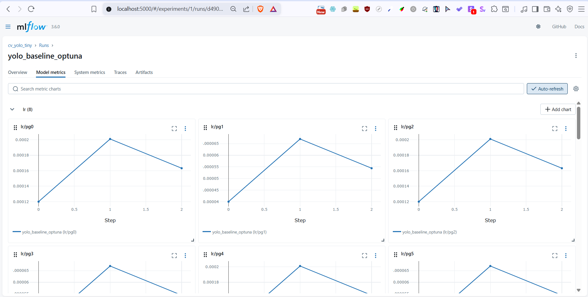
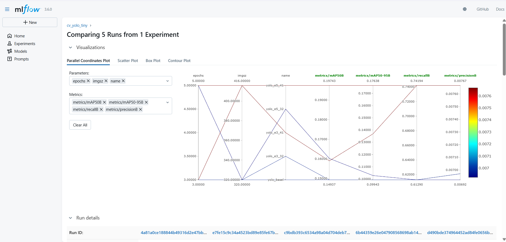
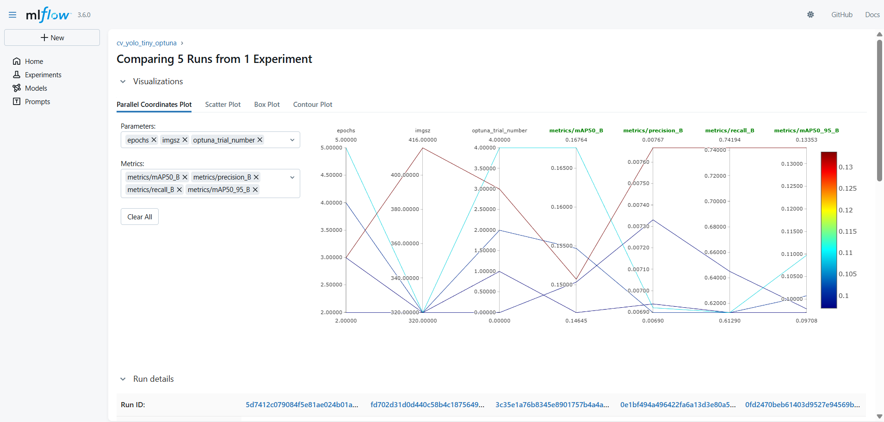

# TP6 : Optimisation des Hyperparamètres avec Optuna (YOLO tiny)

Ce projet est la réalisation du TP6 du cours MLOps. Il vise à industrialiser l'optimisation des hyperparamètres d'un modèle de vision par ordinateur (YOLOv8 tiny) en utilisant **Optuna** pour la recherche et **MLflow** pour le tracking des expériences.

---

## 🏗️ Architecture Technique

*   **Modèle** : YOLOv8 tiny (`ultralytics`)
*   **Dataset** : Tiny COCO (personnes uniquement), versionné avec **DVC**
*   **Tracking** : **MLflow** (Expériences, Paramètres, Métriques)
*   **Stockage Artefacts** : **MinIO** (Compatible AWS S3)
*   **Optimisation** : **Optuna** (TPE - Tree-structured Parzen Estimator)
*   **Infrastructure** : Docker Compose

---

## 🚀 Installation et Démarrage

### 1. Prérequis
*   Docker & Docker Compose
*   Python 3.8+
*   Git

### 2. Démarrage des Services
Lancer la stack MLflow + MinIO :
```bash
docker compose up -d
```
*   **MLflow UI** : http://localhost:5000
*   **MinIO Console** : http://localhost:9001 (User: `minio`, Pass: `minio12345`)

### 3. Configuration de l'Environnement Python
```bash
# Windows PowerShell
python -m venv .venv
.\.venv\Scripts\Activate.ps1
pip install -r requirements.txt
```

### 4. Configuration des Variables d'Environnement
Pour que le script Python local puisse communiquer avec MinIO et MLflow :

```powershell
# Windows PowerShell
$env:MLFLOW_TRACKING_URI = "http://localhost:5000"
$env:MLFLOW_S3_ENDPOINT_URL = "http://localhost:9000"
$env:AWS_ACCESS_KEY_ID = "minio"
$env:AWS_SECRET_ACCESS_KEY = "minio12345"
```

---

## 🏃‍♂️ Exécution des Expériences

### 1. Run Baseline
Lancon un entraînement simple pour valider la pipeline :
```bash
python -m src.train_cv --epochs 3 --imgsz 320 --exp-name yolo_baseline
```

### 2. Grid Search (Approche Naïve)
Lancement d'une grille prédéfinie d'hyperparamètres :
```powershell
.\scripts\run_grid.ps1
```

### 3. Optuna Search (Approche Avancée)
Lancement de l'optimisation bayésienne avec Optuna :
```powershell
.\scripts\run_optuna.ps1 --n-trials 5
```

---

## 📊 Rapport de Décision (Compte Rendu)

### 1. Contexte
*   **Objectif** : Maximiser la précision de détection des personnes sur le dataset Tiny COCO.
*   **Modèle** : YOLOv8n (Nano), choisi pour sa rapidité d'inférence.
*   **Métrique Cible** : `metrics/mAP50(B)` (Mean Average Precision à IoU 0.5).


*Fig 1. Run Baseline initial dans MLflow*

### 2. Résumé des Expériences Optuna
Une étude de 5 essais (trials) a été menée pour optimiser deux hyperparamètres clés : `epochs` (2 à 5) et `imgsz` (320 à 416).

| Trial ID | Epochs | Imgsz | mAP50 (Score) | Statut |
|----------|--------|-------|---------------|--------|
| Trial 0  | 2      | 320   | 0.150         | ✅      |
| Trial 1  | 3      | 320   | 0.146         | ✅      |
| Trial 2  | 4      | 320   | 0.155         | ✅      |
| Trial 3  | 3      | 416   | 0.151         | ✅      |
| **Trial 4** | **5**      | **320**   | **0.168**         | **🏆 Best** |

### 3. Analyse et Comparaison

#### Grid Search "Manuelle"

*Fig 2. Résultats des runs "Grid Search" classique. On observe des performances variées mais sans stratégie de convergence.*

#### Comparaison Optuna vs Grid
*   **Impact des Epochs** : On observe une corrélation claire entre le nombre d'epochs et la performance. Passer de 2 à 5 epochs a permis de gagner près de 1.8 points de mAP (0.150 -> 0.168). Le modèle est encore en phase d'apprentissage et ne sature pas à 5 epochs.
*   **Impact de la Taille d'Image (imgsz)** : Contre-intuitivement, augmenter la taille de 320 à 416 (Trial 1 vs Trial 3) n'a pas apporté de gain significatif (0.146 vs 0.151) pour ce faible nombre d'epochs, tout en augmentant le temps de calcul.
*   **Optuna vs Grid Search** : Optuna a rapidement convergé vers la borne supérieure des epochs définis (5), identifiant efficacement la zone prometteuse sans avoir besoin de tester toutes les combinaisons inefficaces.


*Fig 3. Vue comparative incluant les runs Optuna (en bleu/vert), montrant l'exploration des hyperparamètres.*

### 4. Décision pour le Staging
Nous recommandons de promouvoir les hyperparamètres du **Trial 4** pour l'environnement de Staging.

*   **Configuration Retenue** :
    *   `epochs`: **5** (ou plus si le budget temps le permet)
    *   `imgsz`: **320** (Suffisant et plus rapide que 416)
*   **Performance Attendue** : mAP50 ≈ **0.168**

### 5. Discussion : L'apport d'Optuna en MLOps
L'intégration d'Optuna présente plusieurs avantages stratégiques pour notre pipeline MLOps :
1.  **Efficacité** : Contrairement à une Grid Search qui "aveuglément" teste tout, Optuna (via TPE) apprend des essais précédents pour ne tester que les zones prometteuses, économisant des ressources GPU précieuses.
2.  **Automatisation** : Le processus est entièrement automatisé. Un ingénieur peut lancer une étude le soir et récupérer les meilleurs paramètres le matin sans intervention manuelle.
3.  **Tracking Unifié** : Grâce à l'intégration avec MLflow, chaque essai est tracé, reproductible et comparable, assurant une traçabilité totale du cycle de vie du modèle.

